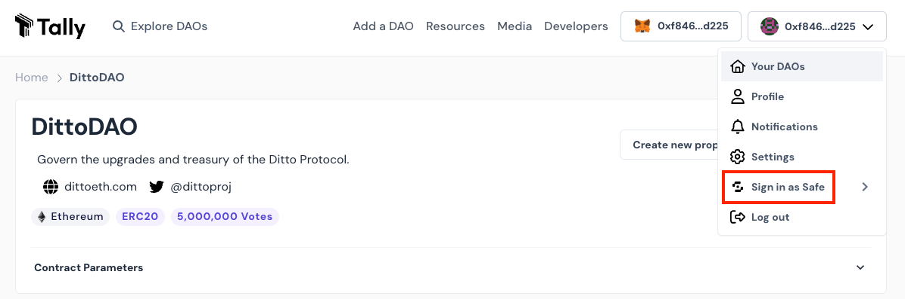
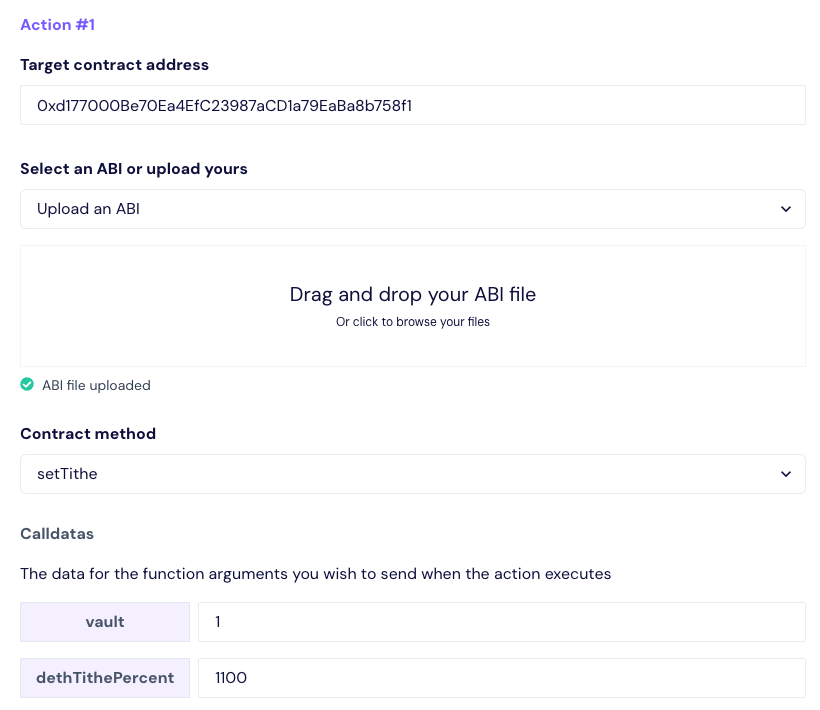
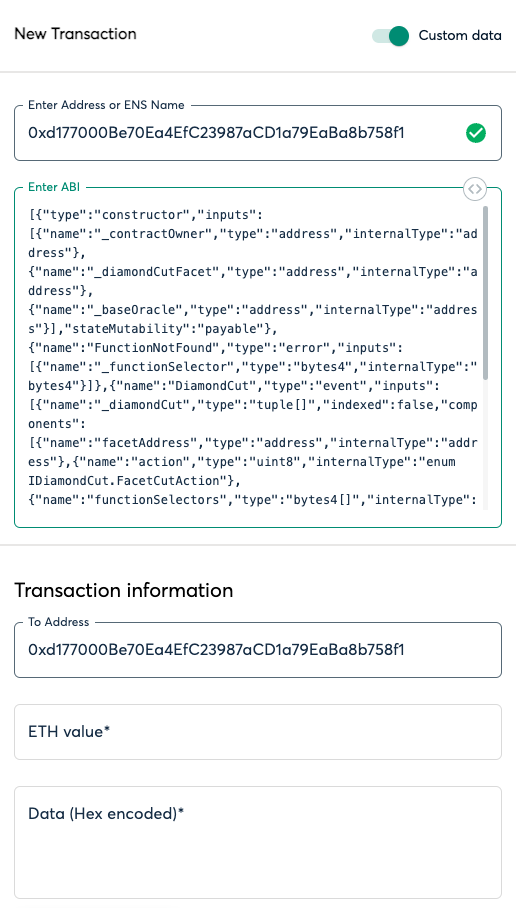

# Migration Guide

## Helpful Tips

1. See example in `migrations/0X_example_migration/`

   a. Fill out `CHAIN`, `WALLET_TYPE`, `SIGNER`, `RPC_URL`, `ACCOUNT`, `PASSWORD` in `.env`

   b. See `.env.example` for more information

2. Remember to review storage variable and slot layouts before migration
3. Remember to run `FOUNDRY_PROFILE=deploy-mainnet forge build` before copying bytecode artifact from `foundry/artifacts-gas/`
4. Adjust `EtherscanDiamondImpl.sol` if there are any API changes

   a. Deploy new `EtherscanDiamondImpl.sol`

   b. Set new dummy implementation in `DiamondEtherscanFacet.sol`

5. Proposals can be submitted via [Tally](https://www.tally.xyz/gov/dittodao)

   a. Standard diamondCut upgrades or parameter updates

   b. Ditto Treasury grant

6. Emergency transactions can be submitted to the timelock via [Safe Wallet](https://app.safe.global/home?safe=eth:0xc74487730fCa3f2040cC0f6Fb95348a9B1c19EFc)

   a. Emergency diamondCut upgrade

7. Verify any deployed contracts using:

   ```sh
   forge verify-contract \
   --chain-id 1 \
   --num-of-optimizations 100000 \
   --watch \
   --compiler-version v0.8.25+commit.d9974bed \
   --constructor-args 0x0000000000000000000000000000000000000000000000000000000000000000 \
   0xDeploymentAddress \
   contracts/facets/Contract.sol:Contract
   ```

   - Make sure `ETHERSCAN_API_KEY` is set in `.env`
   - Replace constructor args with output from `abi.encode(args1, args2);`
   - Replace `0xDeploymentAddress` with address where contract was deployed
   - Replace `contracts/facets/Contract.sol:Contract` with appropriate path

## Using Tally

1. Sign into Tally using a Safe signer
2. Click Sign in as Safe
   

3. Click `Create new proposal` on the `DittoDAO` page
4. Fill out a title and description
5. Fill out action information
   - Target address will likely be `Ditto Diamond` - `0xd177000Be70Ea4EfC23987aCD1a79EaBa8b758f1`
   - Upload the IDiamond.json ABI if necessary
   - Double check inputs and run simulation



## Using Safe

1. Sign into Safe using a Safe signer
2. Select New Transaction > Transaction Builder
3. Toggle `Custom Data` and enter Target Address (ie: Ditto Diamond, create2factory)
4. Copy calldata output from migration script


